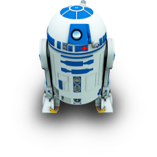
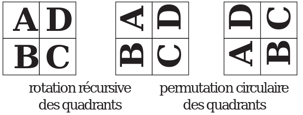
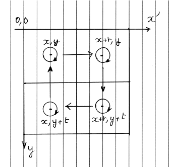

TP FAIRE TOMBER R2D2 - février 2023
=================

## Le problème à résoudre

On souhaite faire tomber R2D2 ! On peut remarquer qu'il s'agit en fait d'effectuer une rotation d'un quart de tour (ou 90°) d'une image *carrée*, par exemple de 512 pixels sur 512 pixels.  


## Principe - Algorithme

Le principe de l’algorithme est illustré par la figure ci-dessous (où on effectue une rotation **à gauche**). Il suit les trois phases de
l’approche « diviser pour régner »:  

1. Diviser : l’image est découpée en quatre zones, par exemple nommées A, B, C et D.
2. Résoudre (*régner*): chaque zone est tournée de 90° par un appel récursif.
3. Combiner : on place les zones tournées à leur emplacement final, en d'autres termes, on effectue une permutation circulaire des quatre zones.



## Modéliser l'image comme un tableau de pixel


```python
from PIL import Image


im = Image.open("img/R2D2.png")
largeur, hauteur = im.size
pix = im.load()
```


```python
largeur
```


    512


`pix` est une instance de la classe `PixelAccess` du module `Image` de la librairie `PIL`. Cet objet peut être vu comme un **tableau de pixels**. Ces derniers étant des n-uplets des composantes Rouge, Vert et Bleu. Pour modifier un pixel aux coordonées `x, y` on effectue l'affectation:  
`pix[x, y] = c` où `c` est un triplet représentant une couleur.


```python
# Permet de visualier l'image avec le programme par défaut
im.show()
```


## Résolution

On suppose pour simplifer que l'image est carrée `(t x t) `où `t` est sa taille et **correspond à une puissance de 2**. La procédure de résolution est la suivante:  

* on découpe l'image en 4 et on effectue récursivement une rotation de 90° (à droite pour R2D2) de chacun des 4 morceaux dont le coin supérieur gauche est situé respectivement aux coordonnées `(x, y)`, `(x+t, y)`, `(x, y+t)` et `(x+t, y+t)`;
* on déplace chacun des morceaux précédent vers leur position finale (permutation circulaire dans le sens horaire).

On peut visualiser ces diverses opérations sur le schéma ci-dessous


La résolution s'appuiera essentiellement sur deux fonctions auxiliaires (*dont on trouvera les signatures ci-dessous*): `rotation_aux` et `echanger_quadrant`.


```python
def rotation_aux(px, coord, t):
    """ Découpe une image en quatre et effectue la rotation de chacun des morceaux.
    Puis, effectue une permutation circulaire des quadrants.
    px: "tableau de pixels" (type PixelAcess);
    coord: coordonnées du coin supérieur gauche de l'image (tuple);
    t: taille de l'image (int).
    """
    # Découpage et rotation 
    # À compléter
    
    # Déplacement des morceaux
    # À compléter
```


```python
def echanger_quadrant(px, coord_orig, coord_dest, t):
    """
    Échange les pixels d'un quadrant origine avec ceux d'un quadrant de destination. Ne renvoie rien.
    px: "tableau de pixels" (PixelAccess)
    coord_orig: coordonnées du coin supérieur gauche du quadrant d'origine (tuple);
    coord_dest: coordonnées du coin supérieur gauche du quadrant de destination (tuple);
    t: taille du quadrant.
    """
    xi, yi = coord_orig
    xf, yf = coord_dest
    # À compléter
```

!!! question "À faire"
    Après avoir compléter les deux fonctions auxiliaires ci-dessus, tester votre code en réalisant l'appel `tomber_R2D2("img/R2D2.png")`.


```python
from PIL import Image


def tomber_R2D2(img):
    """ 
    Tourne l'image 'img' d'1/4 de tour dans le sens des aiguilles d'une montre et l'affiche
    img: nom de fichier image
    """
    
    im = Image.open(img) # Utilisation de la libririe PIL pour plus de commodités
    larg, haut = im.size
    if larg == haut and larg & (larg-1) == 0: # on vérifie que l'image est carrée et
        # que sa taille est une puissance de 2
        pix = im.load()
        rotation_aux(pix, (0, 0), larg)
        im.show()
```


```python
tomber_R2D2("img/R2D2.png")
```
