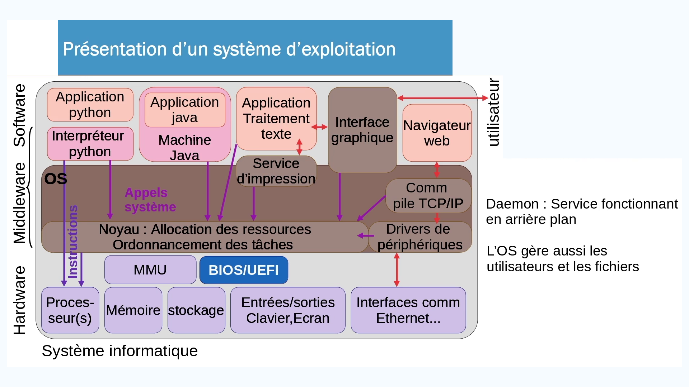
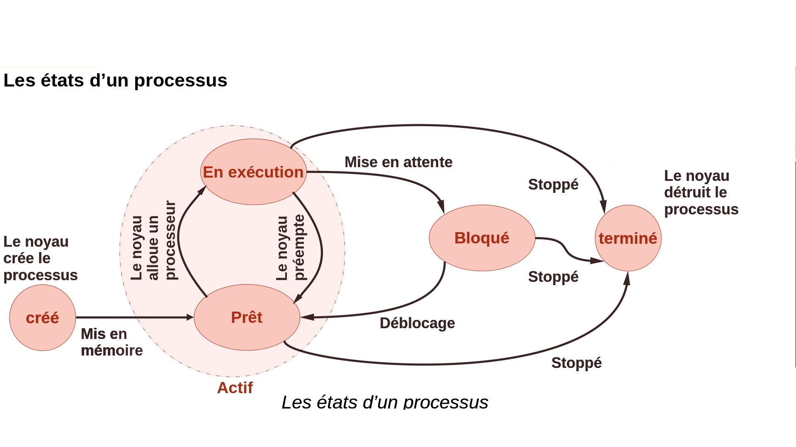
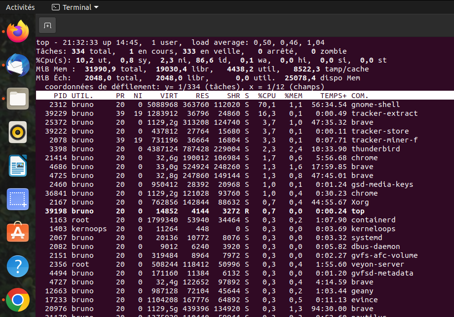
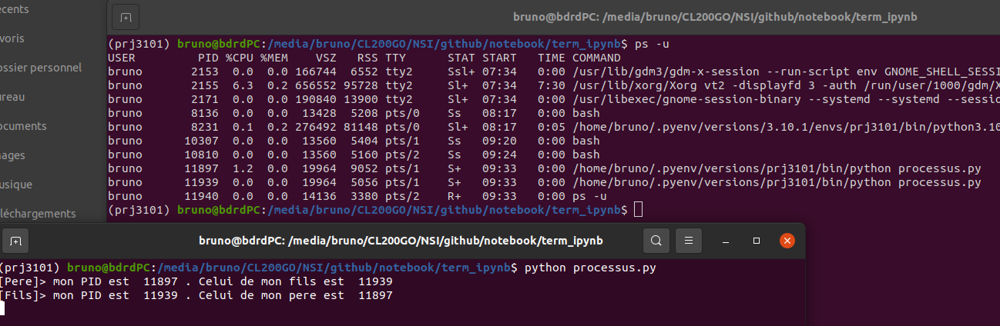
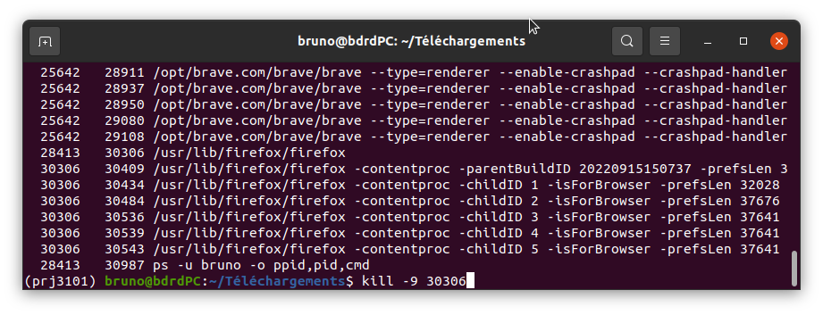
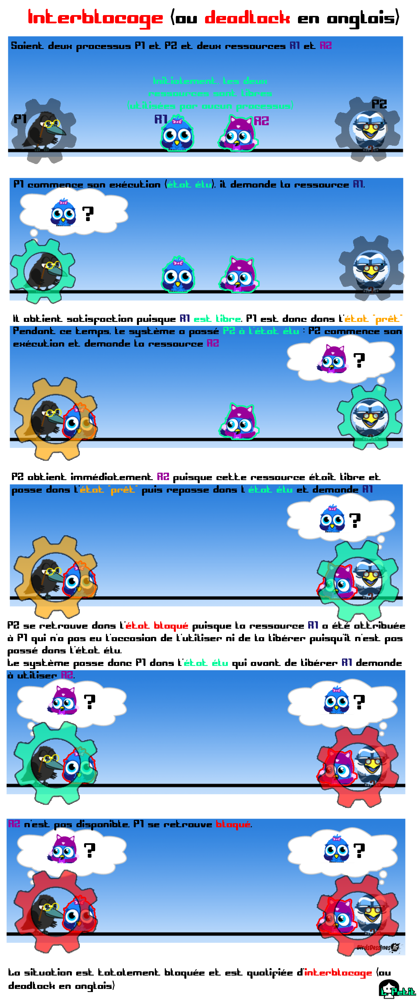

Gestion des ressources par un SE
============================

## Programme

| Contenus | Capacités attendues | Commentaires |
|---|---|---|
| Gestion des processus et des ressources par un système d’exploitation. | Décrire la création d’un processus, l’ordonnancement de plusieurs processus par le système. Mettre en évidence le risque de l’interblocage (deadlock). | À l’aide d’outils standard, il s’agit d’observer les processus actifs ou en attente sur une machine. Une présentation débranchée de l’interblocage peut être proposée. |

## Le système d'exploitation

La tâche principale d'un système d'exploitation est de servir d'intermédiaire entre les applications utilisateurs et le matériel.

Le diagramme ci-dessous détaille quelque peu ce rôle d'*intermédiaire*.


Les systèmes d'exploitation les plus courants sont: Linux, Microsoft Windows, MacOS, android, etc.

## Du programme au processus

C'est au processeur que revient la tâche d'exécuter les instructions des *programmes*. 

!!! info "Programme"
    Un programme est une suite d'instructions statique, généralement stockée sous forme de fichier exécutable, sur le disque.
    
Lors de la lancée d'un programme, le noyau du système d'exploitation (*kernel* en anglais) lui alloue des ressources matérielles (mémoire, temps processeur, etc). Cette instance du programme qui s'exécute s'appelle un **processus**.

!!! tip "À retenir"
    Un processus est un programme en cours d'exécution. C'est une entité dynamique contrairement au fichier stocké sur le disque.
    
Les processus peuvent être créés par le système (pilotes entrées/sorties, sauvegarde, démons, etc.) ou par l'utilisateur en lançant ses applications.

## Ordonnancement des processus

Un processus ne peut à lui seul monopoliser le processeur qui doit être partagé dans le temps. C'est à **l'ordonnanceur** (*scheduler* en anglais) que revient cette tâche.  

Chaque processus va donc alterner entre des états d'exécution et des "états d'attente". Précisons ces divers états:


Un processus dans un état *prêt* ou *en exécution* est un processus **actif**. 

Le passage d'un état *en exécution* à l'état *prêt* d'un processus, au bout d'un certain temps et dont l'origine est le noyau, s'appelle une **préemption**.  

Un processus terminé mais non détruit est appelé **processus zombie**.  

Enfin, un processus en exécution est parfois qualifié d'**élu**.  

Un exemple simplifié d'[ordonnancement](https://tube-sciences-technologies.apps.education.fr/w/1KYjMfuTY5oHDfWAFAhpQ1) avec 3 processus.


```python
from IPython.core.display import HTML

# Peer Tube Sciences Technologies
HTML('<iframe title="exemple_ordonnancement" width="560" height="315" src="https://tube-sciences-technologies.apps.education.fr/videos/embed/0623b160-c14b-4435-a900-d7a547c3329c?start=1s" frameborder="0" allowfullscreen="" sandbox="allow-same-origin allow-scripts allow-popups"></iframe>')
```


<iframe title="exemple_ordonnancement" width="560" height="315" src="https://tube-sciences-technologies.apps.education.fr/videos/embed/0623b160-c14b-4435-a900-d7a547c3329c?start=1s" frameborder="0" allowfullscreen="" sandbox="allow-same-origin allow-scripts allow-popups"></iframe>


## Inspecter les processus d'une machine

Tous les systèmes d'exploitation fournissent des outils qui permettent de visualiser les processus tournant sur une machine. Le système Linux fournit: `ps` pour *process status*. Cette commande supporte de nombreuses options (voir `man ps`). Parmi les plus courantes: 

* `ps -eF` qui liste tous les processus en procédant à un affichage *étendu* sur plusieurs colonnes;
* `ps -u xxxx` où `xxxx` est un nom d'utilisateur: liste tous les processus initiés par l'utilisateur `xxxx`.

Malheureusement l'affichage de cette commande n'est pas rafraichi. De ce fait, on lui préfère souvent la commande `top` qui fournit des informations détaillées, en temps réel:



Quelques commandes intéressantes de `top`:

* `h` : affiche l'aide
* `M` : trie la liste par ordre décroissant d'occupation mémoire. Pratique pour repérer les processus trop gourmands
* `P` : trie la liste par ordre décroissant d'occupation processeur
* `i` : filtre les processus inactifs. Cela ne montre que ceux qui travaillent réellement.
* `k` : permet de tuer un processus - à condition d'en être le propriétaire. Essayez de tuer init ...
* `V` : permet d'avoir la vue arborescente sur les processus.
* `q` : permet de quitter top

## Créer des processus
### Comment créé-t-on des processus ?

La création de processus est une opération privilégiée, réalisée par le système et notamment au démarrage. L'utilisateur peut également être à l'origine d'une création de processus en lançant des applications. 

On peut également créer des processus par programmation. Sur les systèmes UNIX, on utilise la primitive `fork`. Cette fonction permet à un processus de donner naissance à un nouveau processus qui est **sa copie conforme**, par exemple en vue de réaliser un second traitement parallèlement au premier ([voir la page Wikipedia](https://fr.wikipedia.org/wiki/Fork_(programmation)) correspondante).

Le créateur d'un nouveau processus est appelé *le père* et le nouveau processus *le fils*. Chaque processus actif est identifié par un nombre, le *Process IDentifier* ou **PID**. 

En cas de succès, `fork` renvoie le PID du fils dans le processus père et `0` dans le processus fils.  

Enfin, on peut connaître l'identité du père d'un processus grâce au *Parent Process IDentifier* ou **PPID**.

Au démarrage d'un système Linux, le premier processus lancé est `init`, ayant pour PID `1`.

### Exemple avec python

!!! important "Jupyter Notebook"
    L'exécution du programme ci-dessous *plante* le noyau `IPython` de Jupyter. On saisira le script dans un fichier (par exemple `processus.py`) et on le lancera dans un interpréteur de commande avec `python3 processus.py`.
    
```python
import os
import time

pid_pere = os.getpid()
pid_nouveau_proc = os.fork()
# Si fork réussit, on récupère et teste sa valeur de retour
# pour savoir dans quel processus on se trouve
if pid_nouveau_proc == 0: # Fils
    print('[Fils]> mon PID est ', os.getpid(), '. Celui de mon pere est ', pid_pere)
    time.sleep(5)
else: # Père
    print('[Pere]> mon PID est ', pid_pere, '. Celui de mon fils est ', pid_nouveau_proc)
    time.sleep(10)
```

On obtient les résultats suivants:



Avec la commande `ps` on retrouve les deux processus initiés par le script, avec des PID en accord avec l'affichage du script. On note par ailleurs que les deux processus sont dans un état *bloqué* (`S+` voir `man ps`).

## Communiquer avec les processus

Les processus peuvent être destinataires de **signaux** provenant du système d'exploitation ou d'autres processus.  

Un processus envoie un signal à un autre processus en appelant la primitive système `kill`. Dans un shell, on utilisera la commande:  
`kill -numero_de_signal pid_de_processus`.

### Quelques signaux courants

| Numéro signal | Nom du signal | Événement associé |
|---|---|---|
| 2 | SIGINT | Interruption du clavier (frappe de « CTRL C ») |
| 9 | SIGKILL | Terminaison forcée du processus |
| 15 | SIGTERM | Terminaison du processus |
| 20 | SIGTSTP | Caractère « susp » frappé depuis le clavier (frappe de « CTRL Z ») |
| 17 | SIGCHLD | Processus fils terminé |

### Exemple

On souhaite *tuer* le processus `firefox` et ses fils (sachant que `ps` donne ici dans l'ordre `PPID,PID,CMD`.



## Risque d'interblocage

Considérons deux processus $\mathcal{P}_1$ et $\mathcal{P}_2$ ont tous les besoin de deux ressources, $\mathcal{R}_1$ et $\mathcal{R}_2$.
Chaque processus bloque une ressource et doit attendre d’avoir accès à la seconde pour se terminer et les libérer.



Aucun des deux processus ne pourra avancer. C’est **l’interblocage** (ou *deadlock* en anglais) . Sans une intervention, *coûteuse*, du système, la situation est figée.

**Un interblocage correspond à une situation où les processus s'attendent mutuellement**.
