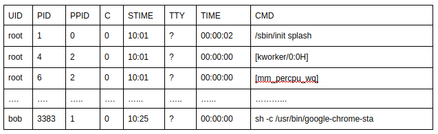
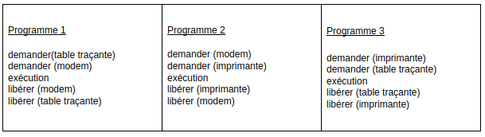
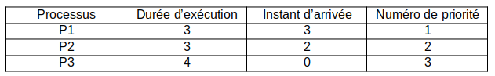

Gestion des ressources par un SE - Exercices
============================================

!!! info "Sources"
    Cette fiche d'exercices provient du travail de David Roche, enseignant de NSI en Haute-Savoie et disponible [sur son site personnel](https://pixees.fr/informatiquelycee/term/c19e.html).

## Exercice 1

*D'après le sujet du bac NSI 2021*

**1)** La commande `ps` suivie éventuellement de diverses options permet de lister les processus actifs ou en attente sur une machine. Sur une machine équipée du système d’exploitation GNU/Linux, la commande `ps -aef` permet d’obtenir la sortie suivante (*extrait*) :  



**a)** Quelle est la particularité de l’utilisateur *root*?

**b)** Quel est le processus parent du processus ayant pour `PID 3383`?

Dans un bureau d’architectes, on dispose de certaines ressources qui ne peuvent être utilisées simultanément par plus d’un processus, comme l’imprimante, la table traçante, le modem. Chaque programme, lorsqu’il s’exécute, demande l’allocation des ressources qui lui sont nécessaires. Lorsqu’il a fini de s’exécuter, il libère ses ressources.



**2)** On appelle $\mathcal{P}_1$, $\mathcal{P}_2$ et $\mathcal{P}_3$ les processus associés respectivement aux programmes 1, 2 et 3.

**a)** Justifier qu'une situation d'interblocage peut se produire.

**b)** Modifier l'ordre des instructions du programme 3 pour qu'une telle situation ne puisse pas se produire.

## Exercice 2

*D'après le sujet du bac NSI 2021*

**Partie A**

Cette partie est un questionnaire à choix multiples (QCM). Pour chacune des questions, une seule des quatre réponses est exacte. Le candidat indiquera sur sa copie le numéro de la question et la lettre correspondant à la réponse exacte. Aucune justification n’est demandée. Une réponse fausse ou une absence de réponse n’enlève aucun point.

**1)** Parmi les commandes ci-dessous, laquelle permet d’afficher les processus en cours d’exécution ?

```
    a. dir
    b. ps
    c. man
    d. ls
```

**2)** Quelle abréviation désigne l’identifiant d’un processus dans un système d’exploitation de type UNIX ?  

```
    a. PIX
    b. SIG
    c. PID
    d. SID
```

**3)** Comment s’appelle la gestion du partage du processeur entre différents processus ?

```
    a. L’interblocage
    b. L’ordonnancement
    c. La planification
    d. La priorisation
```

**4)** Quelle commande permet d’interrompre un processus dans un système d’exploitation de type UNIX ?

```
    a. stop
    b. interrupt
    c. end
    d. kill
```

**Partie B**

**1)** Un processeur choisit à chaque cycle d’exécution le processus qui doit être exécuté. Le tableau ci-dessous donne pour trois processus P1, P2, P3 :

* la durée d’exécution (en nombre de cycles),
* l’instant d’arrivée sur le processeur (exprimé en nombre de cycles à partir de 0),
* le numéro de priorité.

Le numéro de priorité est d’autant plus petit que la priorité est grande. On suppose qu’à chaque instant, c’est le processus qui a le plus petit numéro de priorité qui est exécuté, ce qui peut provoquer la suspension d’un autre processus, lequel reprendra lorsqu’il sera le plus prioritaire.



Reproduire le tableau ci-dessous sur la copie et indiquer dans chacune des cases le processus exécuté à chaque cycle.


**2)** On suppose maintenant que les trois processus précédents s’exécutent et utilisent une ou plusieurs ressources parmi R1, R2 et R3. Parmi les scénarios suivants, lequel provoque un interblocage ? Justifier.


