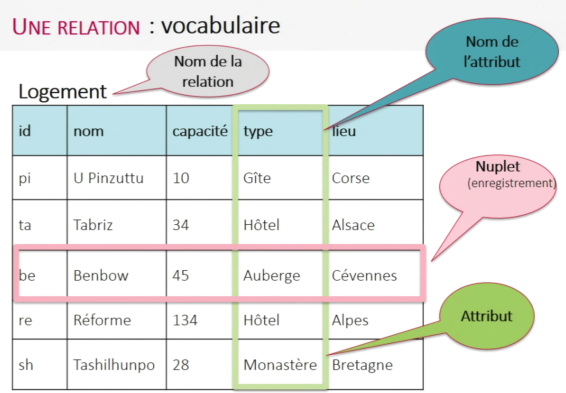
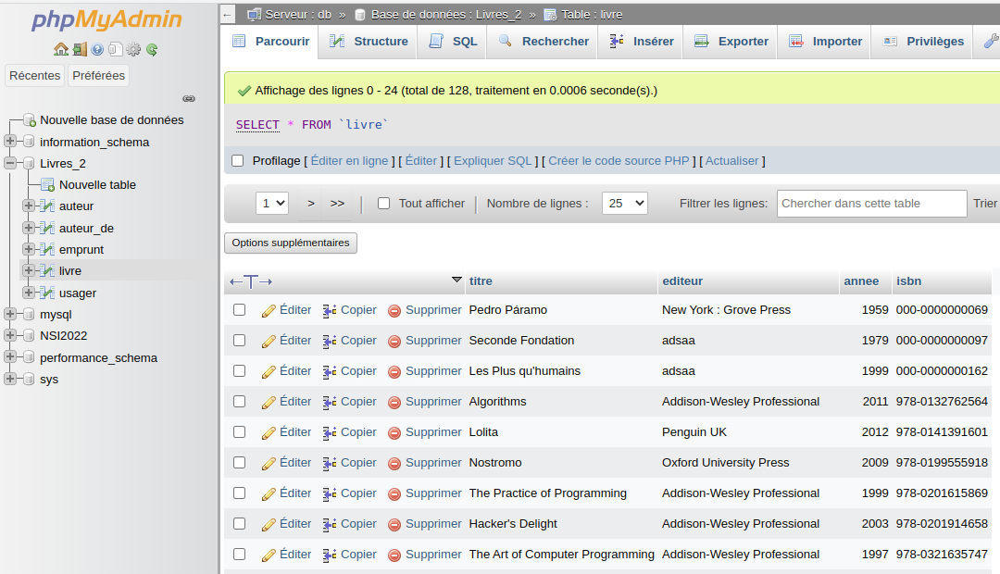

LE MODELE RELATIONNEL
======================

## Introduction

Comme on l'a vu dans l'activité introductive, l'utilisation de structures de données plates souffre de nombreux inconvénients (redondance, mise à jour et recherche difficiles, performances médiocres lorsque le fichier devient volumineux, etc.).  
Plus généralement, pour toute application sérieuse, on se tourne vers une **base de données**. 

!!! tip "Définition"
    On définit une base de données comme une collection de données structurées (*de manière logique*) stockées sur un support persistent.  
    

Modéliser les données nécessitera trois grandes étapes:  

* trouver les objets ou acteurs du problème ainsi les associations existant entre eux -*cette étape n'est pas abordée en terminale*-;
* modéliser les objets / acteurs comme des relations;
* définir les contraintes.

Enfin, pour gérer la base de données on aura un besoin d'un logiciel appelé **Sytème de Gestion de Base de Données** ou **SGBD**. Dans les applications de ce cours, on utilisera le SGBD `MySQL` (*couplé à l'interface phpMyAdmin*).

## Le modèle relationnel - les concepts

Parmi les *modèles* permettant de structurer de manière logique les données, un des plus populaires est le **modèle relationnel** développé en 1970 par l'américain [Edgar Frank Codd](https://fr.wikipedia.org/wiki/Edgar_Frank_Codd).

### Le vocabulaire

Pour Philippe Rigaux, Professeur au CNAM, le **modèle relationnel** est:  

> *un ensemble de résultats scientifiques, qui ont en commun de s’appuyer sur une représentation tabulaire des données*.  

L'expression *modèle relationnel* vient de la notion de **relation** en mathématique.  

#### Relation, n-uplet, attribut, schéma

Dans une première approche, une relation peut être vue comme **un tableau à deux dimensions** (on dit aussi *table*) et est repérée par un nom.  

Une relation est un ensemble fini de **n-uplets** (*lignes*). Chaque composante d'un n-uplet est un **attribut**. L'ensemble des valeurs possibles que peut prendre un attribut est son **domaine**. Le domaine peut être vu comme le *type* en informatique.  

Chaque relation est conforme à un **schéma**. Il s'agit d'un **ensemble ordonné de couple attribut-domaine**, distinct deux-à-deux, qui caractérise un n-uplet.  Par exemple, le **schéma de la relation** `Logement` de l'exemple ci-dessus est:  

*Logement* ((id, `str`), (nom, `str`), (capacité, `int`), (type, `str`), (lieu, `str`))  

Une base de données est un ensemble de relations.

!!! question "Application 1"
    
    1. Ouvrir la base de données `Livres_2` à partir de l'interface *phpMyAdmin*.
    2. Combien de relation comporte cette base?
    3. Donner les attributs ainsi que leur domaine, présents dans la relation `auteur`.
    4. Donner le schéma de la relation `livre`.
    5. Combien de n-uplets comporte la table `usager`?

#### Clé primaire

Si un ensemble d'attributs $\mathcal{K}$ permet d'identifier un unique n-uplet alors c'est **une clé**. Si cet ensemble est minimal on dit que c'est **une clé primaire**.  
Dans la relation `livre` de l'application 1, l'attribut `isbn` constitue une clé primaire.  

  

Très souvent, on sera amené à ajouter une clé *artificielle* qui servira de clé primaire et qui sera un identifiant entier auto-incrémenté.

!!! question "Aplication 2"
    
    1. L'attribut `annee` peut-il être une clé primaire?
    2. L'ensemble `titre, editeur` peut-il être une clé primaire?

#### Clé étrangère

Considérons une relation `INFO_LIVRES` ci-après. Un rapide examen permet de constater que beaucoup d'informations sont dupliquées.

**Relation INFO_LIVRES**

| id | titre                     | nom | prenom | date_nai | langue_ecriture | ann_publi | note | 
|----|---------------------------|------------|---------------|-----------------|------------------------|-----------|------| 
| 1  | 1984                      | Orwell     | George        | 1903            | anglais                | 1949      | 10   | 
| 2  | Dune                      | Herbert    | Frank         | 1920            | anglais                | 1965      | 8    | 
| 3  | Fondation                 | Asimov     | Isaac         | 1920            | anglais                | 1951      | 9    | 
| 4  | Le meilleur des mondes    | Huxley     | Aldous        | 1894            | anglais                | 1931      | 7    | 
| 5  | Fahrenheit 451            | Bradbury   | Ray           | 1920            | anglais                | 1953      | 7    | 
| 6  | Ubik                      | K.Dick     | Philip        | 1928            | anglais                | 1969      | 9    | 
| 7  | Chroniques martiennes     | Bradbury   | Ray           | 1920            | anglais                | 1950      | 8    | 
| 8  | La nuit des temps         | Barjavel   | René          | 1911            | français               | 1968      | 7    | 
| 9  | Blade Runner              | K.Dick     | Philip        | 1928            | anglais                | 1968      | 8    | 
| 10 | Les Robots                | Asimov     | Isaac         | 1920            | anglais                | 1950      | 9    | 
| 11 | La Planète des singes     | Boulle     | Pierre        | 1912            | français               | 1963      | 8    | 
| 12 | Ravage                    | Barjavel   | René          | 1911            | français               | 1943      | 8    | 
| 13 | Le Maître du Haut Château | K.Dick     | Philip        | 1928            | anglais                | 1962      | 8    | 
| 14 | Le monde des Ā            | Van Vogt   | Alfred Elton  | 1912            | anglais                | 1945      | 7    | 
| 15 | La Fin de l’éternité      | Asimov     | Isaac         | 1920            | anglais                | 1955      | 8    | 
| 16 | De la Terre à la Lune     | Verne      | Jules         | 1828            | français               | 1865      | 10   | 

Dans l'activité d'introduction sur les *insuffisances des structures de données plates* on a vu qu'une solution au problème de redondance était la séparation des données en plusieurs tables. On parvient alors à **reconstruire toute l'information avec un ou des attributs jouant le rôle de lien**.  

Ici, on sépare les informations dans deux tables `LIVRES` et `AUTEURS`.

**Relation AUTEURS**  

| id | nom      | prenom       | ann_naissance | langue_ecriture | 
|----|----------|--------------|---------------|-----------------| 
| 1  | Orwell   | George       | 1903          | anglais         | 
| 2  | Herbert  | Frank        | 1920          | anglais         | 
| 3  | Asimov   | Isaac        | 1920          | anglais         | 
| 4  | Huxley   | Aldous       | 1894          | anglais         | 
| 5  | Bradbury | Ray          | 1920          | anglais         | 
| 6  | K.Dick   | Philip       | 1928          | anglais         | 
| 7  | Barjavel | René         | 1911          | français        | 
| 8  | Boulle   | Pierre       | 1912          | français        | 
| 9  | Van Vogt | Alfred Elton | 1912          | anglais         | 
| 10 | Verne    | Jules        | 1828          | français        | 

**Relation LIVRES**

| id | titre                     | id_auteur | ann_publi | note | 
|----|---------------------------|-----------|-----------|------| 
| 1  | 1984                      | 1         | 1949      | 10   | 
| 2  | Dune                      | 2         | 1965      | 8    | 
| 3  | Fondation                 | 3         | 1951      | 9    | 
| 4  | Le meilleur des mondes    | 4         | 1931      | 7    | 
| 5  | Fahrenheit 451            | 5         | 1953      | 7    | 
| 6  | Ubik                      | 6         | 1969      | 9    | 
| 7  | Chroniques martiennes     | 5         | 1950      | 8    | 
| 8  | La nuit des temps         | 7         | 1968      | 7    | 
| 9  | Blade Runner              | 6         | 1968      | 8    | 
| 10 | Les Robots                | 3         | 1950      | 9    | 
| 11 | La Planète des singes     | 8         | 1963      | 8    | 
| 12 | Ravage                    | 7         | 1943      | 8    | 
| 13 | Le Maître du Haut Château | 6         | 1962      | 8    | 
| 14 | Le monde des Ā            | 9         | 1945      | 7    | 
| 15 | La Fin de l’éternité      | 3         | 1955      | 8    | 
| 16 | De la Terre à la Lune     | 10        | 1865      | 10   | 

Dans cet exemple, la relation `LIVRES` possède un attribut `id_auteur` qui correspond à l'attribut `id` de la relation `AUTEURS`.  
Cet attribut de la relation `LIVRES` qui fait référence à la clé primaire d'une autre relation est appelée **clé étrangère**.  

Dans le schéma d'une relation, **la clé primaire est souvent soulignée** et les éventuelles **clés étangères sont précédées du signe** `#`.

!!! question "Application 3"
    Écrire le schéma des relations `LIVRES` et `AUTEURS`.

### Les contraintes d'intégrité

Un contrainte d'intégrité est une **propriété logique, vérifiée à chaque instant et qui garantit la cohérence des données**.

#### Contrainte de domaine

Les contraintes de domaine sont utiles pour contrôler le type de données stockées. Cela est intégré au modèle relationnel. Par exemple, dans la table `Logement` évoquée plus haut, une entrée comme `10` pour l'attribut `id` sera refusée car le domaine de cet attribut est une chaîne de caractère.

#### Contrainte d'intégrité des relations

Cette contrainte permet d'assurer que chaque relation a bien une clé primaire unique et bien définie. Deux n-uplets ne peuvent avoir les mêmes valeurs pour l'ensemble des attributs.  

Par exemple, dans la relation `LIVRES`, choisir `titre` comme clé n'est pas une bonne idée (*on peut avoir deux livres avec le même titre*). On lui préfère une clé artificielle `id`.

#### Contrainte d'intégrité référentielle

Cette contrainte permet d'assurer que chaque valeur d'une clé étrangère doit correspondre une valeur de clé primaire associée.  
Par exemple, dans la relation `LIVRES` possède une clé étrangère `id_auteur`. Pour qu'une valeur de `id_auteur` soit acceptée, il faut que cette valeur apparaisse dans la clé primaire de `AUTEURS`

---

**Références**  

Spécialité NSI - Terminale - pages 285 - 294; Balabonski & al; ellipses  
Site David Roche https://pixees.fr/informatiquelycee/n_site/nsi_term_bd_rela.html

**Liens intéressants pour manipuler les tables en markdown**  

[convertion HTML vers csv](https://www.convertcsv.com/html-table-to-csv.htm)  
[convertion csv vers markdown](https://donatstudios.com/CsvToMarkdownTable)
