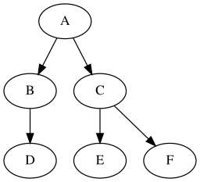

ARBRES
=======

## Structures arborescentes

La structure de liste chaînée rencontrée précédemment est intéressante lorsqu'on a besoin d'un **accès séquentiel** aux éléments. En revanche, elle est peu adaptée à des accès arbitraires. Dans ce cas de figure, une structure **arborescente** peut être envisagée. Il s'agit d'une autre famille de structures chaînées qui permet d'organiser les informations stockées de **manière hiérarchique**. Les applications sont très nombreuses; on peut citer par exemple:  

* arborescence du système de fichier d'un ordinateur;
* expression arithmétique;
* structure des pages web;
* arbre généalogique;
* etc.

## Arbres binaires 

### Définitions

Un arbre est une structure arborescente particulière, composée de **noeuds**. Dans un arbre **binaire** chaque noeud présente au maximum 2 *branches*.  

  

Un arbre qui ne comporte pas de noeud est un **arbre vide**.  Si l'arbre n'est pas vide, il comporte:  

* un noeud particulier appelé **racine**;
* deux sous ensembles de noeuds appelés **sous arbre gauche** et **sous arbre droit**.

*Remarque*: la racine est reliée à la racine des sous arbres (sauf s'il est vide).  

Un noeud qui a deux sous arbres vides est **une feuille**.  
Dans l'exemple ci-dessus:  

* `A` est la racine;
* `D`, `E` et `F` sont des feuilles.  

La **taille** $N$ d'un arbre correspond au nombre de noeuds. Par exemple, la taille de l'arbre présenté en introduction est $N=6$.  
La **hauteur** $h$ d'un arbre correspond au **nombre maximal de noeuds rencontrés en descendant de la racine à une feuille**. Par exemple, l'arbre présenté en introduction a une hauteur $h=3$.

### Encadrement de la taille

La taille d'un arbre vérifie une double inégalité:  

$$h \leq N \leq 2^{h} -1$$  

La borne inférieure correspond à un arbre dont chaque noeud ne présente qu'une branche, dans ce cas $N = h$ (Fig. 1). La borne supérieure correspond à un arbre où chaque niveau est complet, dans ce cas $N=2^{h}-1$ (Fig. 2).  

 (Fig. 1)  (Fig. 2)


## Une représentation possible en python

### Utilisation d'une classe

De la même façon qu'on a construit les listes chaînées avec des *cellules*, on va utiliser une **classe Noeud** pour décrire un arbre. Un noeud comporte une information ou *valeur*, une référence vers le sous arbre gauche et une référence vers le sous arbre droit.


```python
class Noeud:
    """ Une classe pour modéliser les noeuds d'un arbre"""
    
    def __init__(self, v, fg, fd):
        self.val = v
        self.gauche = fg
        self.droit = fd        
```

Ainsi, l'arbre donné en introduction peut être codé de la manière suivante:


```python
arb1 = Noeud('A', 
             Noeud('B', Noeud('D', None, None), None), 
             Noeud('C', Noeud('E', None, None), Noeud('F', None, None))
            )
```


```python
print(arb1.val)
print(arb1.gauche.val)
```

    A
    B


### Taille et hauteur

La taille d'un arbre vide vaut 0. S'il n'est pas vide, sa taille est:  

**1 (racine) + taille sous arbre gauche + taille sous arbre droit**

Une telle présentation incite à écrire une fonction récursive. Coder cette fonction.


```python
def taille(arb):
    """ Renvoie la taille de l'arbre passé en paramètre"""
    
    if arb is None:
        return 0
    else:
        return 1 + taille(arb.gauche) + taille(arb.droit)
```


```python
assert taille(arb1) == 6
```

La hauteur d'un arbre vide est nulle. Si l'arbre n'est pas vide, sa hauteur vaut:  

$$ 1 + \text{max}(hauteur(\text{sous arbre gauche}), hauteur(\text{sous arbre droit}))$$  

Coder une fonction récursive qui renvoie la hauteur d'un arbre passé en paramètre.


```python
def hauteur(arb):
    """ Renvoie la hauteur de l'arbre 'arb'"""
    
    if arb is None:
        return 0
    else:
        return 1 + max(hauteur(arb.gauche), hauteur(arb.droit))
```


```python
hauteur(arb1)
```


    3


## Parcours d'un arbre en profondeur d'abord

Dans quel ordre parcourir les noeuds d'un arbre? Il existe plusieurs possibilités:  

* si on traite d'abord la racine, puis le sous arbre gauche, puis le sous arbre droit, l'ordre est dit **préfixe**;
* si on traite d'abord le sous arbre gauche, puis la racine, puis le sous arbre droit, l'ordre est dit **infixe**;
* si on traite d'abord le sous arbre gauche, puis le sous arbre droit, puis la racine, l'ordre est dit **postfixe** ou **suffixe**.  


```python
def parcours_prefixe(arb):
    """ Parcours préfixe d'un arbre"""
    
    if arb is None:
        return
    else:
        print(arb.val, end=' ')
        parcours_prefixe(arb.gauche)
        parcours_prefixe(arb.droit)
```


```python
parcours_prefixe(arb1)
```

    A B D C E F 


```python
def parcours_infixe(arb):
    """ Parcours préfixe d'un arbre"""
    
    if arb is None:
        return
    else:
        parcours_infixe(arb.gauche)
        print(arb.val, end=' ')
        parcours_infixe(arb.droit)
```


```python
parcours_infixe(arb1)
```

    D B A E C F 

Ecrire la fonction qui renvoie le parcours postfixe d'un arbre.


```python
from queue import Queue
help(Queue.get)
```

    Help on function get in module queue:
    
    get(self, block=True, timeout=None)
        Remove and return an item from the queue.
        
        If optional args 'block' is true and 'timeout' is None (the default),
        block if necessary until an item is available. If 'timeout' is
        a non-negative number, it blocks at most 'timeout' seconds and raises
        the Empty exception if no item was available within that time.
        Otherwise ('block' is false), return an item if one is immediately
        available, else raise the Empty exception ('timeout' is ignored
        in that case).
    


## Parcours en largeur d'abord

Ce parcours est moins trivial que le précédent. Il s'agit de parcourir l'arbre par niveau. On commence par la racine puis les racines de ses deux sous arbres et ainsi de suite. Une structure de données adaptée à ce problème est la file. 

Description d'un algorithme itératif  
*On suppose l'arbre non vide*.  

* on enfile l'arbre;
* tant que la file n'est pas vide:  

    - on défile un élément (en fait un arbre);
    - on affiche la valeur de sa racine;
    - on enfile ses deux sous arbres s'ils ne sont pas vides

!!! question "À faire"
    Compléter la fonction `parcours_largeur` puis tester.


```python
from queue import Queue


def parcours_largeur(arbre):
    """ Affiche la valeur des noeuds trouvés lors d'un parcours en largeur d'un arbre;
    arbre: arbre binaire
    """
    assert a is not None
    f = Queue() # On crée une file vide
    f.put(arbre) # On enfile l'arbre
    while not f.empty():
        x = f.get() # défile un élément
        print(x.val, end=' ')
        if x.gauche is not None:
            ...
        if x.droit is not None:
            ...
```
