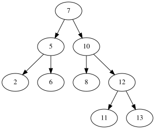
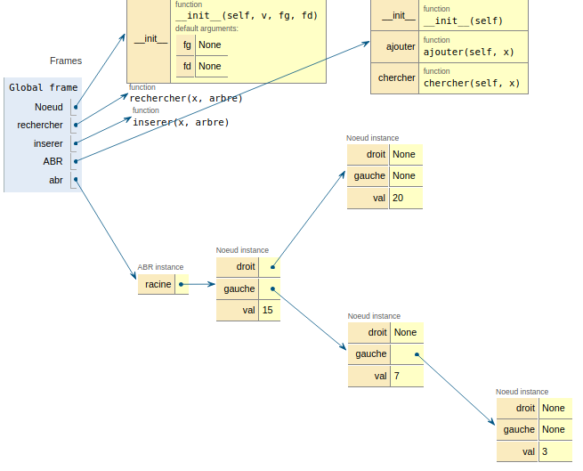

Algorithmes sur les ABR
====================

## Définition et représentation des arbres binaires de recherche en python

Un arbre binaire de recherche (en abrégé **ABR**) est un arbre binaire dont les noeuds contiennent des valeurs comparables. **Pour tout noeud d'un ABR toutes les valeurs situées dans le sous arbre gauche sont inférieures à celle du noeud.** De la même façon, **toutes les valeurs situées dans le sous arbre droit sont supérieures à celle du noeud.**

Exemples d'ABR  
 

Un ABR étant un arbre binaire, on peut le représenter comme précédemment avec une classe `Noeud` avec une contrainte sur la valeur des noeuds: **ils doivent être comparables**.  
Avec la classe `Noeud` du chapitre précédent, les deux ABR ci-dessus sont modélisés de la façon suivante:


```python
class Noeud:
    """ Une classe pour modéliser les noeuds d'un arbre"""
    
    def __init__(self, v, fg=None, fd=None):
        self.val = v
        self.gauche = fg
        self.droit = fd     
```


```python
abr1 = Noeud(20,
            Noeud(10, Noeud(5), Noeud(15)), 
            Noeud(25, Noeud(21), Noeud(26))
            )

abr2 = Noeud(7,
            Noeud(5, Noeud(2), Noeud(6)),
            Noeud(10, Noeud(8), Noeud(12, Noeud(11), Noeud(13)))
            )
```

*Remarque*: dans la méthode `__init__`, `fg` et `fd` ont une valeur par défaut égale à `None`, cela permet juste une écriture plus compacte lors de la création d'une instance en évitant de réécrire `None` lorsqu'un noeud n'a pas de fils.

## Recherche dans un ABR

Chercher une valeur dans un ABR revient à **la comparer à la valeur de la racine** puis, si elle est différente, à poursuivre la recherche dans **un seul** des sous arbres.  

La recherche d'une valeur ou *clé* $x$ dans un arbre binaire de recherche `arb` peut être menée avec l'algorithme ci-dessous qui renvoie le noeud où la valeur est présente ou `None` si la recherche n'aboutit pas.  

```
Algorithme recherche(x, arbre)
----------------------------
si arbre est vide
    renvoyer Faux
si x < arbre.val
    renvoyer recherche(x, arbre.gauche)
sinon si x > arbre.val
    renvoyer recherche(x, arbre.droit)
sinon
    renvoyer Vrai
```

!!! question "À faire"
    Implémenter cet algorithme en python.


```python
def rechercher(x, arbre):
    """ 
    recherche une valeur x dans un ABR;
    renvoie un booléen correspondant à la presence ou non de x dans arbre
    x: élément comparable avec les valeurs présentes dans l'arbre
    arbre: arbre binaire de recherche
    """
    if arbre is None:
        return False
    # À compléter
```


```python
# A DECOMMENTER ET EXECUTER
assert rechercher(10, abr2) == True
assert rechercher(35, abr2) == False
print("Validé !")
```

**Efficacité de la recherche**  

Dans le cas idéal, **si l'arbre est équilibré**, chaque appel de `rechercher(x, arbre)` élimine la moitié des éléments. Cette recherche est alors à rapprocher de la recherche dichotomique vue en 1re (*et dans des exercices d'entrainement EP*), dont la complexité est **logarithmique**.  
Dans le pire des cas, si l'arbre est *filiforme*, la recherche est peu efficace et sa complexité est alors linéaire.

## Insertion dans un ABR

Comme précédemment, on va privilégier une méthode récursive pour insérer une valeur $x$ dans un arbre tout en gardant **la structure d'arbre binaire de recherche**.  
Le cas de base est simple: si **l'arbre est vide**, il suffit de renvoyer un noeud ayant $x$ comme valeur.
Sinon (*cas récursif*), on compare $x$ à la valeur du noeud:

```
si x < arbre.val
    "placer" x dans le sous arbre gauche
sinon
    "placer" x dans le sous arbre droit
```

Attention à l'interprétation de ` "placer" x` lors de l'implémentation et notamment au type renvoyé.  

Implémenter cette fonction en python.


```python
def inserer(x, arbre):
    """
    insère x dans un ABR tout en gardant la structure d'ABR;
    x: élément comparable avec les valeurs présentes dans l'arbre
    arbre: arbre binaire de recherche
    """
    if arbre is None:
        return Noeud(x)
    # À compléter
```

!!! question "À faire"
    Vérifier sur pythontutor que les insertions suivantes sont correctes.  

```python
abr = None # abr est un arbre vide
abr = inserer(15, abr)
abr = inserer(20, abr)
abr = inserer(7, abr)
abr = inserer(3, abr)
```

**Efficacité de l'insertion**  

Cette fonction présente une complexité temporelle identique à celle qui effectuait la recherche. Cette complexité va dépendre de la forme de l'arbre.

!!! question "À faire"
    Travail à effectuer: comme pour les listes chaînées, compléter la classe `ABR` dont l'interface propose les méthodes `chercher` et `ajouter`.


```python
class ABR:
    """ Une classe pour els arbres binaires de recherche"""
    
    def __init__(self):
        self.racine = None
    
    def ajouter(self, x):
        self.racine = ...
    
    def chercher(self, x):
        return ...
```


```python
# Une autre possibilité : inclure les codes de inserer et rechercher
# dans le code de la classe
"""
class ABR:    
    def __init__(self):
        self.racine = None
    
    def ajouter(self, x):
        def insere(x, arbre):
            if arbre is None:
                return Noeud(x)
            if x < arbre.val:
                return Noeud(arbre.val, insere(x,arbre.gauche), arbre.droit)
            else:
                return Noeud(arbre.val, arbre.gauche, insere(x, arbre.droit))
        self.racine = insere(x, self.racine)
    
    def chercher(self, x):
        def rechercher(x, arbre):
            if arbre is None:
                return False
            if x < arbre.val:
                return rechercher(x, arbre.gauche)
            elif x > arbre.val:
                return rechercher(x, arbre.droit)
            else:
                return True
        return rechercher(x, self.racine)
"""    
```


```python
abr = ABR()
abr.ajouter(15)
abr.ajouter(20)
abr.ajouter(7)
abr.ajouter(3)
```



## Parcours d'un ABR


```python
class Noeud:
    """ Une classe pour modéliser les noeuds d'un arbre"""
    
    def __init__(self, v, fg=None, fd=None):
        self.val = v
        self.gauche = fg
        self.droit = fd 
        
a = Noeud('A', 
          Noeud('B'),
          Noeud('K', Noeud('L', Noeud('S'), Noeud('Y')),
                Noeud('P', None, Noeud('Z')))
)

def parcoursInfixe(r):
    if r is not None:
        parcoursInfixe(r.gauche)
        print(r.val, end=' ')
        parcoursInfixe(r.droit)
        
        
def parcoursPostfixe(r):
    if r is not None:
        parcoursPostfixe(r.gauche)
        parcoursPostfixe(r.droit)
        print(r.val, end=' ')
        
parcoursPostfixe(a)
```

    B S Y L Z P K A 
