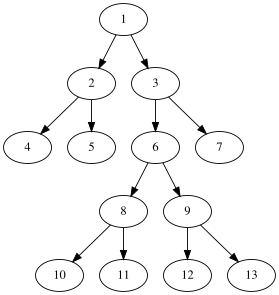
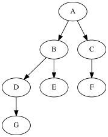

Les arbres binaires en terminale NSI
===========

## Le cours



1. Quelles sont la taille et la hauteur de cet arbre ?
2. Dans un parcours infixe, donner l'ordre des noeuds visités.

**Données**


```python
class Noeud:
    """ Une classe pour modéliser les noeuds d'un arbre"""
    
    def __init__(self, v, fg, fd):
        self.val = v
        self.gauche = fg
        self.droit = fd 
```


```python
arb1 = Noeud('1',
             Noeud('2', Noeud('4', None, None), Noeud('5', None, None)),
             Noeud('3', Noeud('6', 
                             Noeud('8', Noeud('10', None, None), Noeud('11', None, None)),
                             Noeud('9', Noeud('12', None, None), Noeud('13', None, None))),
                  Noeud('7', None, None))
)
```

## Applications directes

Soit l'arbre de la figure suivante.  

  

1. En utilisant la classe `Noeud` de l'exercice précédent, définir un objet `arb2` qui pourrait le décrire. *Pour éviter les ambiguités: G est le fils droit de D et F est le fils gauche de C*
2. Quelle est la hauteur de cet arbre?
3. Donner les noeuds visités lors d'un parcours postfixe.
4. Compléter la fonction récursive `affiche`qui:  

   * affiche un point `.` et qui ne renvoie rien pour un arbre vide;
   * affiche une parenthèse ouvrante ` (`, le sous arbre gauche, le sous arbre droit, la valeur et enfin une parenthèse fermante ` )` autrement.  
   
 Par exemple pour l'arbre présenté ici, `affiche(arb2)` fournit:  
```
( ( (. (..G )D ) (..E )B ) ( (..F ).C )A )
```

5. Dessiner l'arbre qui fournit `( (. (..C )B )(..D )A )`


```python
arb2 = Noeud('A',
            Noeud('B', 
                  Noeud('D', None, Noeud('G', None, None)), 
                  Noeud('E', None, None)),
            Noeud('C', Noeud('F', None, None), None)
            )
```


```python
def affiche(arb):
    """ Affiche un arbre binaire"""
    
    if arb is None:
        print('.', end='')
        return
    else:
        print(' (', end='')
        ...        
        ...
        print(..., end='')
        print(' )', end='')
```


```python
affiche(arb2)
```

     ( ( (. (..G )D ) (..E )B ) ( (..F ).C )A )

## Un peigne gauche

Compléter la fonction qui prend en paramètre un entier naturel $h$ et qui renvoie un arbre de hauteur $h$ où chaque noeud n'a **pas de sous arbre droit**. Vérifier le résultat avec la fonction `affiche` de l'exercice précédent.  

!!! tip "Indication 1"
    Deux méthodes sont acceptées: récursive ou itérative.  

!!! tip "Indication 1: Méthode récursive"
    peigne_recursif(h)
    un peigne vide a une hauteur nulle;  
    un peigne de hauteur h est un noeud dont:
    
    * la valeur est h;
    * le sous arbre gauche est un peigne de hauteur h-1;
    * le sous arbre droit est vide


```python
def peigne(h):
    """ 
    Renvoie un peigne gauche de hauteur h (méthode itérative);
    h: entier naturel
    """
    
    noeud_courant = None
    i = h
    while i > 0:
        noeud_courant = Noeud(..., ..., ...)
        i -= 1
    return noeud_courant
```


```python
p = peigne(4)
```


```python
p
```


    <__main__.Noeud at 0x7f75fbf36eb8>


```python
# Tester
affiche(p)
```


```python
# Une version récursive

def peignerec(h, acc=1):
    """
    Renvoie un peigne gauche de hauteur h;
    h: entier naturel
    """
    if h == 0:
        return None
    else:
        return Noeud(acc, peignerec(h-1,acc+1), None)
```


```python
p2 = peignerec(4)
```


```python
p2.gauche
```


```python
# Tester
affiche(p2)
```
