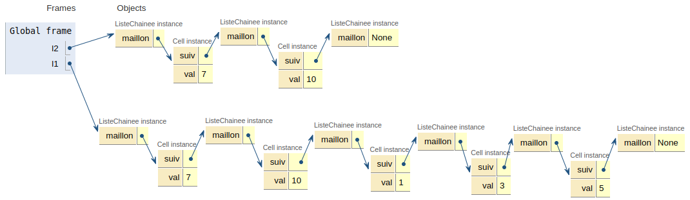

TAD Liste : Exercices
=================

## Exercice 1 Insertion / Suppression

On reprend la réalisation d'une liste chaînée du cours et on se propose d'ajouter à l'ensemble des opérations, l'insertion et la suppression d'un élément à un index donné.


```python
class Cell:
    """ Une classe pour décrire une cellule (maillon) d'une liste chainée"""
    
    def __init__(self, v, s):
        self.cle = v
        self.suiv = s

def est_vide(l):
    return l is None

def tete(l):
    """ Renvoie l'élément de tête de l"""
    assert l is not None, "tete: erreur liste vide"
    return l.cle

def queue(l):
    """ Renvoie une liste correspondant à la queue de l"""
    assert not est_vide(l), "queue: erreur liste vide"
    return l.suiv
```

**1.** Écrire une fonction `inserer` qui prend pour paramètres un élément `x`, une position `k`, une liste chaînée non vide `l` et qui va insèrer `x` à l'index `k` de la liste `l`.


```python
def inserer(x, k, l):
    """ Insère x à l'index k de la liste l non vide"""
    if k == 0:
        c = Cell(tete(l), queue(l))
        l.cle = x
        l.suiv = c
    else:
        pos = 1
        # Initialisation de 2 pointeurs et de la cellule à insérer
        # +---+---+---+...
        # | x0| x1| x2|...
        # +---+---+---+...
        #   ^   ^ 
        #   |   |
        #  av. insertion
        #      (pos)
        cell_avant = l
        cell_insertion = queue(l)
        cell_a_inserer = Cell(x, None)
        
        # Déplacement des pointeurs jusqu'à trouver l'index k
        while pos != k:
            cell_insertion = queue(cell_insertion)
            cell_avant = queue(cell_avant)
            pos += 1
        
        # On a trouvé la position, on assure maintenant le chaînage
        cell_avant.suiv = cell_a_inserer
        cell_a_inserer.suiv = cell_insertion
        
lst = Cell(3, Cell(7, Cell(9, None)))
inserer(-1, 0, lst)

print(tete(queue(lst)))
print(tete(lst))
```

    3
    -1


**2.** Écrire une fonction `supprimer` qui prend en paramètres un index `k` et une liste `l` non vide et qui supprime l'élément d'index `k` de la liste. 


```python
def supprimer(k, l):
    """ Supprime la cellule d'index k de la liste non vide l"""
    if k == 0:
        l.cle = tete(queue(l))
        l.suiv = queue(queue(l))
    else:
        pos = 1
        # Initialisation de 2 pointeurs autour de la cellule à supprimer
        # +---+---+---+...
        # | x0| x1| x2|...
        # +---+---+---+...
        #   ^   ^   ^
        #   |   |   |
        #  av.suppr \
        #            apres
        cell_avant = l
        cell_apres = queue(queue(l))
        # Déplacement des pointeurs autour de l'index k
        while pos != k:
            cell_apres = queue(cell_apres)
            cell_avant = queue(cell_avant)
            pos += 1
        
        # On a trouvé la cellule à supprimer, on établit
        # le chaînage de manière à la "court-circuiter"
        cell_avant.suiv = cell_apres
```


```python
supprimer(0, lst)
print(tete(lst))
print(tete(queue(lst)))
```

    3
    7


**3.** Que peut-on dire du coût en temps de ces opérations?

## Problème 1 - La concaténation de deux listes chaînées

On reprend la structure de liste chainée vue en cours, construite avec la classe `ListeChainee`.


```python
class Cell:
    """ Une classe pour décrire un maillon d'une liste chainée"""
    
    def __init__(self, v, s):
        self.val = v
        self.suiv = s

class ListeChainee:
    def __init__(self, m=None):
        """Initialise une liste vide."""
        self.maillon = m
    
    def est_vide(self):
        return self.maillon is None
    
    def insert(self, element):
        """ Construit une liste en insérant 'element' en tete"""
        
        # On fait attention à maintenir un chaînage correct: 
        # un maillon a 2 composantes: un élément et une ListeChainee !
        self.maillon = Cell(element, ListeChainee(self.maillon))
        
    def tete(self):
        """Renvoie le contenu de la premiere cellule"""
        
        assert self.maillon  is not None , "tete : erreur liste vide"
        return self.maillon.val
    
    def queue(self):
        """Renvoie la queue de la liste"""
        
        assert self.maillon  is not None , "queue : erreur liste vide"
        return self.maillon.suiv
```

L'objectif de cet exercice est d'écrire une fonction permettant de **concaténer** (*mettre bout à bout*) deux listes.

### Solution autorisant les effets de bord

Étant données deux listes chainées `l1` et `l2`:


```python
l1 = ListeChainee()
l1.insert(5)
l1.insert(3)
l1.insert(1)

l2 = ListeChainee()
l2.insert(10)
l2.insert(7)
```

Qu'est-ce que la concaténation de `l1` et `l2`? 

* Si `l2` est vide, la réponse est triviale, il s'agit de `l1`;
* Sinon il s'agit de la liste construite à partir de l'élément de tête de `l2` et de la concaténation de `l1` avec la queue de `l2`.

Voici une illustration de la situation après une telle concaténation:



1. Compléter la fonction `concat` ci-dessous qui prend en paramètres deux listes `l1` et `l2` et qui procède à leur concaténation, c'est-à-dire qui place `l1` au bout de `l2`. Le résultat de la concaténation se trouvant dans `l1`.

```python
def concat(l1, l2):
    """ renvoie la concaténation l2,l1, avec résultat dans l1"""
    if ...:
        return l1
    else:
        concat(l1, ...).insert(...)
        return l1
```


```python
# Votre réponse
```


```python
# TESTS - À exécuter
l1 = ListeChainee()
l1.insert(5)
l1.insert(3)
l1.insert(1)

l2 = ListeChainee()
l2.insert(10)
l2.insert(7)

def dernier(l):
    """ renvoie la dernière cellule de l"""
    assert not l.est_vide()
    cellule = l
    # On déplace la cellule tant que la queue n'est vide.
    while not cellule.queue().est_vide():
        cellule = cellule.queue()
    return cellule

l = concat(l1, l2)
assert l.tete() == 7
assert l.queue().tete() == 10
assert dernier(l).tete() == 5
print('Test OK')
```

    Test OK


2. La fonction `concat` est-elle récursive?
3. Quel problème peut-on identifier?

### Solution réduisant les effets de bord

On souhaite contourner le problème identifié précédémment, en travaillant sur une copie de liste. Le code d'une fonction `copie` est donnée ci-dessous. 


```python
def copie(c, liste):
    """ Réalise la copie de 'liste' dans une liste chaînée vide c."""
    if liste.queue().est_vide():
        c.insert(liste.tete())
    else:
        copie(c, liste.queue())
        c.insert(liste.tete())        
```

**1.** Écrire le code permettant de réaliser une copie de la liste `l1` utilisée dans les tests précédents.


```python
# Réponse
```

**2.** Compléter la fonction `concaténer` ci-dessous:

```python
def concatener(l1, l2):
    """ Renvoie une nouvelle liste chaînée issue de la concaténation de l1 et l2;
    l1, l2: listes chaînées
    """
    l1_copie = ...
    copie(l1_copie, l1)
    concat(..., ...)
    return l1_copie
```


```python
def concat(l1, l2):
    """ renvoie la concaténation de l2 + l1 (l1 "au bout" de l2) en mettant le résultat étant dans l1"""
    if l2.est_vide():
        return l1
    else:
        concat(l1, l2.queue()).insert(l2.tete())
        return l1

def concatener(l1, l2):
    """ Renvoie une nouvelle liste chaînée issue de la concaténation de l1 et l2;
    l1, l2: listes chaînées
    """
    l1_copie = ListeChainee()
    copie(l1_copie, l1)
    concat(l1_copie, l2)
    return l1_copie
```

**3.** Tester votre fonction `concaténer`.


```python
# TESTS
l1 = ListeChainee()
l1.insert(5)
l1.insert(3)
l1.insert(1)

l2 = ListeChainee()
l2.insert(10)
l2.insert(7)

l3 = concatener(l2, l1)

while not l3.est_vide():
    print(l3.tete(), end=' ')
    l3 = l3.queue()
```

## Exercice 1 - Recherche séquentielle dans une liste chaînée

Ecrire une fonction `trouver(x, lst)` qui renvoie l'index de la première occurence de `x` dans la liste chaînée `lst` ou `None` si non trouvé. On donnera deux versions: récursive et itérative. Tester.


```python
# récursif
def place(x, l, i):
    """ Fonction auxilliaire récursive pour 'trouver' """
    if l.est_vide():
        return None
    elif x == l.tete():
        return i
    else:
        return place(x, l.queue(), i+1)
    
def trouver(x, lst):
    return place(x, lst, 0)

# itératif
def trouver_iter(x, lst):
    i = 0
    while not lst.est_vide():
        if lst.tete() == x:
            return i
        i += 1
        lst = lst.queue()
    return None
```


```python
# TESTS
l1 = ListeChainee()
l1.insert(5)
l1.insert(3)
l1.insert(1)
l1.insert(10)
l1.insert(7)

def test_trouver(val, lst):
    t = lst
    print(f'Cherche {val} récursif ----')
    print(trouver(val, t))
    while not t.est_vide():
        print(t.tete(), end=' ')
        t = t.queue()

    t = lst
    print(f'\n\nCherche {val} Itératif ----')
    print(trouver_iter(val, t))
    while not t.est_vide():
        print(t.tete(), end=' ')
        t = t.queue()
    print('\n\n')
    
test_trouver(1, l1)
test_trouver(100, l1)
```

    Cherche 1 récursif ----
    2
    7 10 1 3 5 
    
    Cherche 1 Itératif ----
    2
    7 10 1 3 5 
    
    
    Cherche 100 récursif ----
    None
    7 10 1 3 5 
    
    Cherche 100 Itératif ----
    None
    7 10 1 3 5 
    
    


## Exercice 2 - Insertion dans une liste triée

**1.** Écrire une fonction `inserer(x, lst)` qui prend en paramètres un entier `x` et une liste chaînée `lst` d'entiers, supposée triée par ordre croissant et qui renvoie **une nouvelle liste** dans laquelle `x` a été inséré *à sa place*. 

!!! hint "Coup de pouce"
    Pensez à revoir [l'exercice 5 (optionnel)](https://brunodrd.github.io/nsiboisdo/NSITerm/LP2/C1E1.html) du chapitre 1.


```python
def insert(x, lst):
    if lst.est_vide():
        l = ListeChainee()
        l.insert(x)
        return l
    elif x < lst.tete():
        l = ListeChainee()
        l.insert(x)
        return concatener(lst, l)
    else:
        l = ListeChainee()
        l.insert(lst.tete())
        return concatener(insert(x, lst.queue()), l)
        
```

**2.** Vérifier votre réponse en utilisant la cellule ci-dessous.


```python
# Tests
l1 = ListeChainee()
l1.insert(5)
l1.insert(3)
l1.insert(1)
l2 = ListeChainee()
l4 = insert(5, l1)
while not l4.est_vide():
    print(l4.tete(), end=' ')
    l4 = l4.queue()
```

### Exercice 3 - Listes identiques

Ecrire une fonction `identiques(l1, l2)` qui renvoie un booléen indiquant si les listes `l1` et `l2` sont identiques c'est-à-dire contiennent les mêmes éléments, dans le même ordre.


```python
def identiques(l1, l2):
    while not l1.est_vide() and not l2.est_vide():
        if l1.tete() != l2.tete():
            return False
        l1 = l1.queue()
        l2 = l2.queue()
    if l1.est_vide():
        return l2.est_vide()
    return l1.est_vide()
```


```python
# Tests
l1 = ListeChainee()
l1.insert(5)
l1.insert(3)
l1.insert(1)
l2 = ListeChainee()
l3 = ListeChainee()
l3.insert(5)
l3.insert(3)
l3.insert(1)
print(identiques(l1, l3))
print(identiques(l1, l2))
```

## Problème 4 - Création d'une classe Pile avec une liste chaînée

L'interface de la structure de données `Pile` comporte (*rappels !*) les opérations suivantes:  

* est_pilevide;
* empiler;
* dépiler;

On se propose de donner une réalisation possible avec une liste chaînée, en adoptant le paradigme objet.


```python
class Cell:
    """ Une classe pour décrire un maillon d'une liste chainée"""
    
    def __init__(self, v, s):
        self.val = v
        self.suiv = s
```

On crée une classe `Pile` en l'initialisant avec une liste vide. Compléter les méthodes de cette classe.


```python
class Pile:
    """ Une classe pile à base de liste chaînée"""
    
    def __init__(self):
        self._pile = ListeChainee()
        
    def est_pilevide(self):
        return self._pile.est_vide()
    
    def empiler(self, x):
        self._pile.insert(x)
        
    def depiler(self):
        assert not self.est_pilevide(), "Erreur pile vide"
        
        val = self._pile.tete()
        self._pile = self._pile.queue()
        return val
        
    def sommet(self):
        assert not self.est_pilevide()
        return self._pile.tete()
```


```python
# TESTS - A EXECUTER
def test_pile():    
    p = Pile()
    p.empiler(10)
    p.empiler(20)
    p.empiler(5)

    assert p.sommet() == 5
    assert p.depiler() == 5
    assert p.sommet() == 20
    p.depiler()
    p.depiler()
    p.est_pilevide()
    return 'Tests OK'

test_pile()
```
