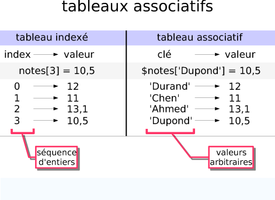
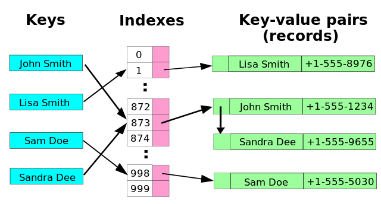
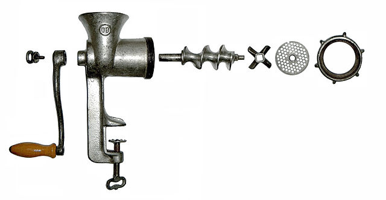

Le TAD dictionnaire ou tableau associatif
=================================

## Description

Un dictionnaire ou tableau associatif peut être vu comme la généralisation du tableau vu en 1re, où son index n'est plus forcément un entier naturel.  

<figure>

</figure>

D'un point de vue formel, un dictionnaire ou tableau associatif est un ensemble de paire (*clé, valeur*) dans lequel chaque clé n'apparaît qu'une fois.

Contrairement à la liste où l'ordre est fondamental, un dictionnaire n'est, à priori, pas ordonné. La propriété importante d'un dictionnaire est la présence ou l'absence d'un élément.

Les applications sont nombreuses: compilateurs, routeurs, base de données, etc.

## Les opérations 

Les trois principales opérations portant sur les dictionnaires sont: l'insertion, la suppression et la recherche. Plus formellement, si $D$ est un dictionnaire:

* `D.inserer(e: élément de type (clé, valeur))`: la nouvelle paire a été intégré au dictionnaire;
* `D.supprimer(k: clé)`: l'élément dont la clé est `k` a été supprimé du dictionnaire;
* `D.rechercher(k)`: si l'élément dont la clé est `k` est présent dans $D$, alors on renvoie la valeur associée sinon on renvoie *rien*.

Par ailleurs, on trouve fréquemment une opération `iterer` qui permet de boucler sur toutes les clés du dictionnaire.

## Implémentation
### Les solutions

Les deux principales implémentations efficaces de dictionnaires sont réalisées à base de *table de hachage* et d'*arbre*.

Savoir réaliser ces deux implémentations **ne figure pas au programme de terminale NSI**. Cependant, on va exposer ici les principales idées utilisées dans les tables de hachage.

<figure>

</figure>

Les clés sont transformées au préalable en index entier grâce à une fonction dite de *hachage*. Grâce à cet index, on peut stocker l'information (*clé, valeur*) dans un tableau (appelé table de hachage).

On peut remarquer que deux clés peuvent conduire à un même index. Cet événement s'appelle une *collision*. Divers algorithmes existent pour gérer les cas de collision.

### Exemple (peu efficace)

On utilise une fonction de hachage qui transforme une clé de type chaîne de caractères en entier, à partir de leur code ascii . Voir cet exemple d'implémentation [sur Capytale](https://capytale2.ac-paris.fr/web/c/8ea4-843279)

## Recherche d'une valeur: comparaison liste / dictionnaire

<figure>
    
</figure>

Dans une liste, la recherche d'une valeur peut avoir un coût en temps proportionnel à la taille $n$  de la liste (ou $\mathcal{O}(n)$). Le pire des cas arrive si la valeur est absente de la liste.

Dans le cas du dictionnaire, tout va dépendre de la qualité de la fonction de hachage et de la taille de la table de hachage.

<figure>
    
</figure>

Un bon choix peut conduire à des recherches en temps constant (ou $\mathcal{O}(1)$).

Voici un résumé des performances de ces deux types de données ([disponible sur la page wikipedia en anglais](https://en.wikipedia.org/wiki/Associative_array) consacrée aux tableaux associatifs).

|              | Recherche        |                  | Insertion        |                  |
|--------------|------------------|------------------|------------------|------------------|
|              | En moyenne       | Pire des cas     | En moyenne       | Pire des cas     |
| Dictionnaire | $\mathcal{O}(1)$ | $\mathcal{O}(n)$ | $\mathcal{O}(1)$ | $\mathcal{O}(n)$ |
| Liste        | $\mathcal{O}(n)$ | $\mathcal{O}(n)$ | $\mathcal{O}(1)$ | $\mathcal{O}(1)$ |
